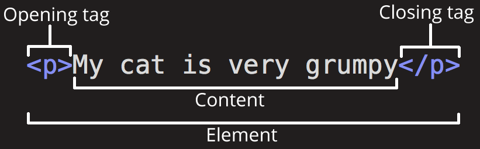

HTML, also known as **Hypertext Markup Language** is one of the core markup languages interpreted by our web browsers to display the content and structure of a website.

It was created by physicist Time Berners-Lee in 1989 while working at CERN. He paved the way for the World Wide Web to its birth and has been used by us humans ever since.

You see the skeleton up there? That is a perfect analogy for HTML. HTML creates the structure of the body, CSS dresses it up with style, and JavaScript provides the movements and interactivity, bringing the body of the web page to life.

In context, HTML sets up the overall layout and organization of the content such as headings, paragraphs, images, links, and others.

## HTML is _Not_ a Programming Language

Like CSS, HTML is not a programming language because it lacks the ability to perform logic and algorithm necessary to process and manipulate data**.** Rather, HTML is considered a markup language in a way that it assigns meaning to a content through the use of elements and attributes.

### How does it work?

As mentioned earlier, HTML works by setting up the structure and contents of a webpage. It utilizes markup elements to instruct the browser on how to render various types of content.

Sure, it is more complicated than you think it is, but you’ll find interesting intricacies as you practice and collaborate with others.

### A look at an HTML Element

A basic yet common HTML element consists of an opening tag and closing tag, encapsulating the content which is displayed visibly on your browser’s screen.

So, I laid some simple yet important overview about HTML. Awesome right? Hope you learn something here as I am also continually learning by sharing my knowledge to everyone.

If you’re reading this, especially if you’re on a similar path as I am in programming, welcome aboard! Let’s learn, grow, and conquer the world of coding together!
