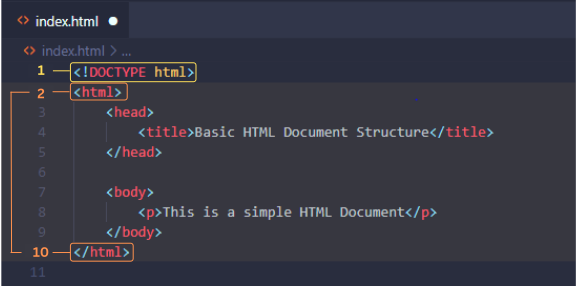
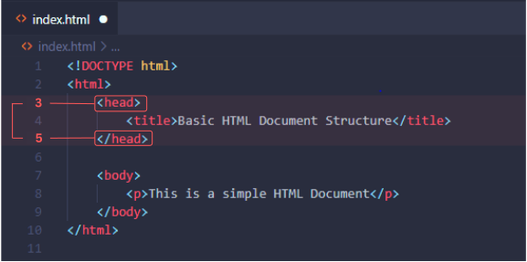
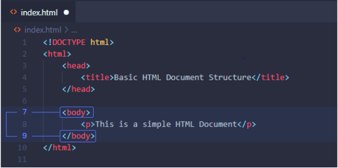
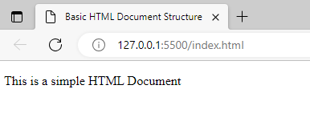

The HTML Document Structure can be easily scanned in a matter of minutes. Tutorials and courses often lead learners to rush the materials since it cut time, leaving many beginners like me struggling to grasp each component's fundamentals. This results in more questions and confusion at a later time.

The HTML Document Structure composes four (4) main areas: <!DOCTYPE html>, <html>, <head>, and <body>

Let's look at them now!

Document Type Declaration and the Root Element

> 💡 `<!DOCTYPE html>` declaration lets the browser know how the document should be interpreted and specifies the version of HTML which is currently HTML5.

- Ensures up to HTML5 standards: Using <!DOCTYPE html> at the beginning before the <html> root element tells that your document conforms to the latest version of HTML. Hence, the browser will process and render according to the current HTML5 specifications.

- Can I not include it? Excluding this declaration will still cause browsers to render the content, but only in "quirk mode". In this mode, browsers try to display the content based on older versions of HTML, which can lead to inconsistent rendering and layout issues.

- Be aware of its significance: HTML evolves and may introduce more features and changes in the future. Knowing the significance of the <!DOCTYPE html> declaration is valuable.

Features: Display: None | Void element | Structural Usage

> 💡 `<html>` element serves as the root element of the document. Anything between the opening and the closing </html> tag contains the content of the HTML document.

- The root of all elements: <html> element is a top-level element often tagged as the "root element" as it encloses all elements necessary to give instructions to the web browser for display.

- Nested structure: <html> element contains two distinct sections: the <head> and the <body> section. With nesting, the <html> element acts as a container of all the HTML code of an entire document.

- May contain attributes: Attributes provide additional information about the element. One prime example is the <lang> attribute. More on this on the next topics.

Features: Display: Block | Structural Usage

## The Head Section:

> `<head>` element is used to define the metadata and provide instructions about the document itself.

- Metadata and Semantic Information: These are set of instructions inside the opening <head> tag and the closing </head> that cannot be viewed on the browsers' webpage.

- Examples of common elements in the <head>: <meta> , <links>, <title> , and <scripts> - for internal styling (Topic to be covered in CSS)

Features: Display: None | Structural Usage

## The Body Section:

> `<body>` element is where your content is displayed and visible in your web browser. This is where the majority of your code is usually written. The elements used in the body will determine the organization and structure of your webpage's content.

- Structure and Organization: The <body> element comes after your <head> element. It is where you create and organize your content through hierarchal and appropriate use of elements. This is like your canvas for building and arranging the content of your webpage.

- Presentation: In the <body> element, you can apply styling to your content, especially when working with libraries and frameworks. More advanced topics on Inline Styling in CSS will cover this aspect of style customization.

- Javascript Interactions: The <body> element is also the place where you can place your JavaScript code either inline (not recommended for larger code) or by using <script> element.

By understanding the HTML document structure, you'll be able to create a well-organized and semantically meaningful webpage. This basic yet comprehensive overview of the HTML Document Structure will be your friend as you move forward to learning advance Web Development concepts.

Ops, here is the output we get for the code above, simple yet fundemantally correct.

_References: HTML Standard (whatwg.org) | HTML Tutorial (w3schools.com) | HTML: HyperText Markup Language | MDN (mozilla.org)_
